# LangChain RAG Application Project

This project demonstrates the use of LangChain to implement a Retrieval-Augmented Generation (RAG) application. The application integrates prompt templates, LLM chains, retrieval mechanisms, and conversation memory to answer user queries based on content from a web source.

## Getting Started

These instructions will help you get a copy of the project up and running on your local machine for development and testing purposes.

### Prerequisites

You need to install the following tools and configure their dependencies:

1. **Python** (version 3.13 or higher)
    ```sh
    python --version
    ```
    Should return something like:
    ```sh 
    Python 3.13.0
    ```

2.  **Git**
    - Install Git by following the instructions [here](http://git-scm.com/book/en/v2/Getting-Started-Installing-Git)

    Verify the installation:
    ```sh
    git --version
    ```
    Should return something like:
    ```sh
    git version 2.25.1
    ```

## Installing

1. Clone the repository and navigate into the project directory:
    ```sh
    git clone https://github.com/Sebasvasquezz/LangChain-RAG-Tutorial.git

    cd LangChain-RAG-Tutorial
    ```
2. Before running the application you need to get the OpenAI api key and replace it in the line:
    ```python
    os.environ["OPENAI_API_KEY"] = "YOUR_API_KEY_HERE"
    ```

    and the LangChain api key in the line:
    ```python
    os.environ["LANGCHAIN_API_KEY"] = "YOUR_API_KEY_HERE"
    ```
## Running the Notebook
Run each cell in the notebook one by one, ensuring each step completes without errors.

### Cell Descriptions

1. **Cell 1**: This cell installs and updates the `langchain`, `langchain-community`, and `langchain-chroma` libraries silently.
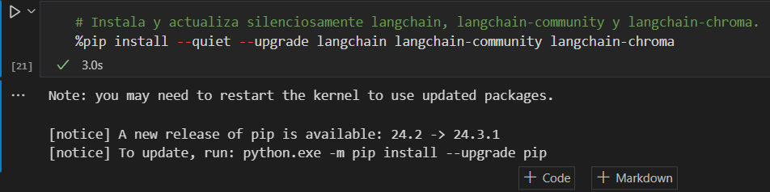

2. **Cell 2**: This cell sets up environment variables for LangSmith tracking and authentication.
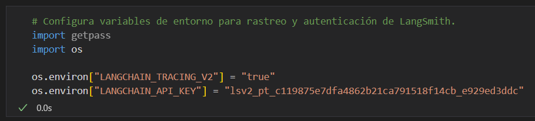

3. **Cell 3**: This cell configures the OpenAI API key for accessing its models and installs `BeautifulSoup` for parsing HTML.
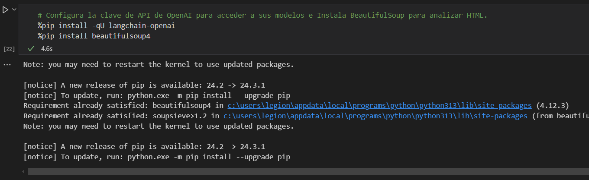

4. **Cell 4**: This cell creates an instance of the `ChatOpenAI` GPT-4 mini model.
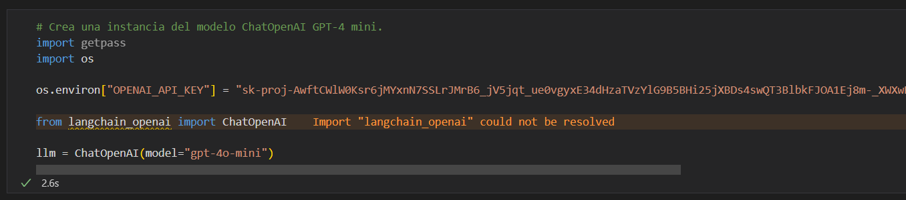

5. **Cell 5**: This cell extracts specific data (title, header, content) from a web page using `BeautifulSoup`.
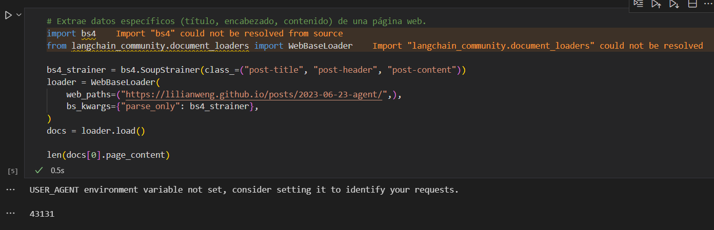

6. **Cell 6**: This cell prints the first 500 characters of the loaded content.
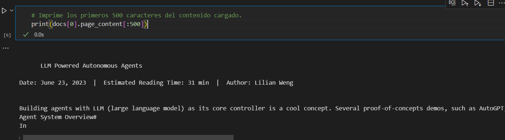

7. **Cell 7**: This cell sets up a text splitter that includes start indices for dividing text into chunks.
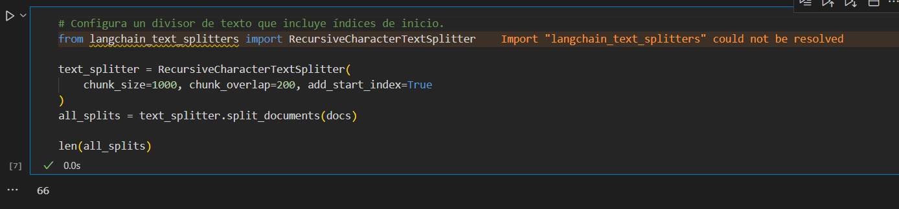

8. **Cell 8**: This cell displays the length of the content of the first chunk.
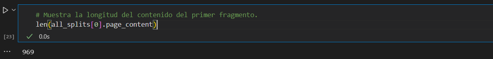

9. **Cell 9**: This cell displays the metadata of the tenth chunk.
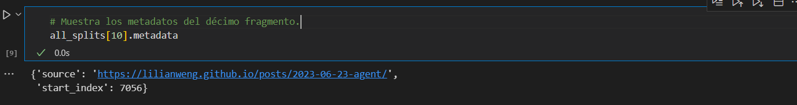

10. **Cell 10**: This cell creates and stores the text chunks in a vector database.
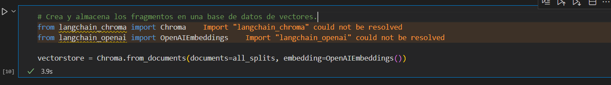

11. **Cell 11**: This cell sets up a retriever and performs a sample query on the vector database.
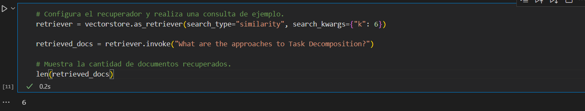

12. **Cell 12**: This cell prints the content of the first retrieved document.
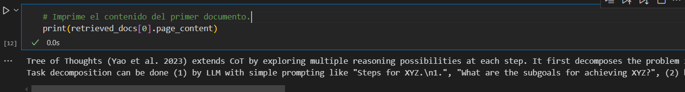

13. **Cell 13**: This cell updates the `langchain-openai` library once again.
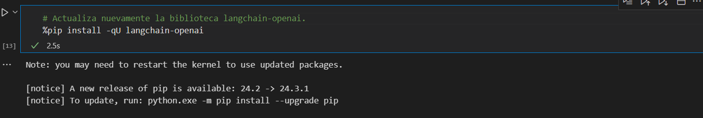

14. **Cell 14**: This cell configures OpenAI and creates another instance of the GPT-4 mini model.
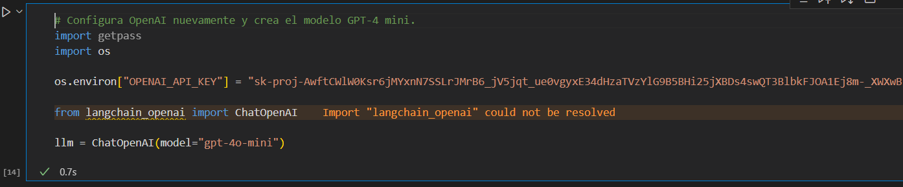

15. **Cell 15**: This cell sets up and runs a sample prompt using the prompt hub from LangChain.
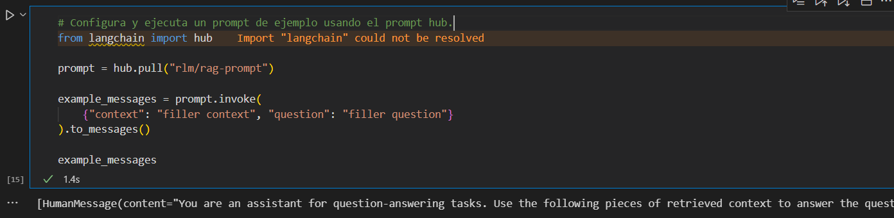

16. **Cell 16**: This cell prints the content of an example message from the prompt hub.
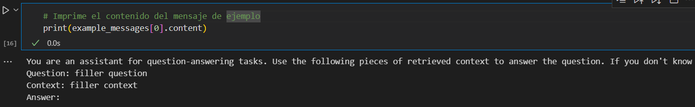

17. **Cell 17**: This cell sets up and runs a Retrieval-Augmented Generation (RAG) chain for continuous response generation.
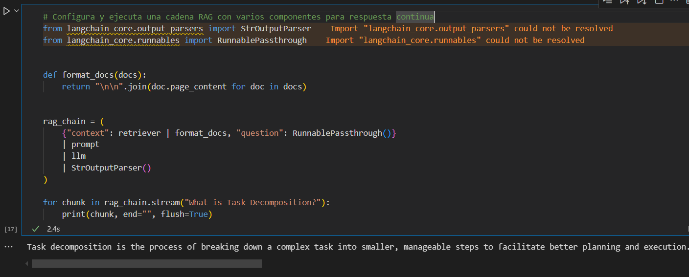

18. **Cell 18**: This cell creates a sub-chain for testing retrieval functionality.
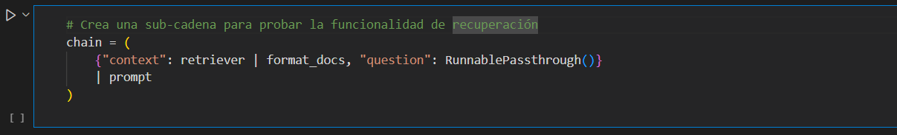

19. **Cell 19**: This cell configures a RAG chain with templates for answering questions.
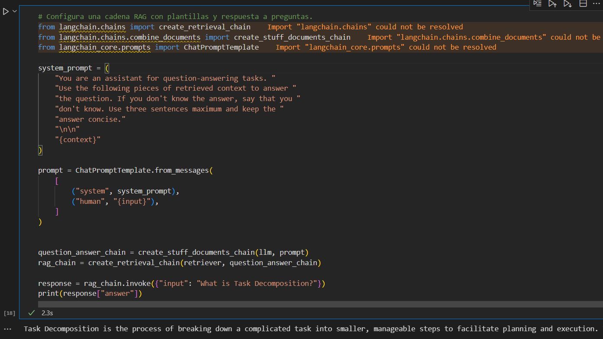

20. **Cell 20**: This cell prints the source documents retrieved by the RAG chain.
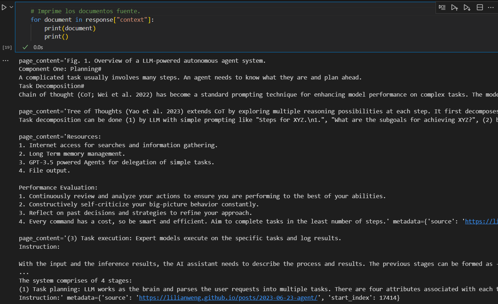

21. **Cell 21**: This cell sets up and runs a custom prompt using LangChain core's prompt templates.
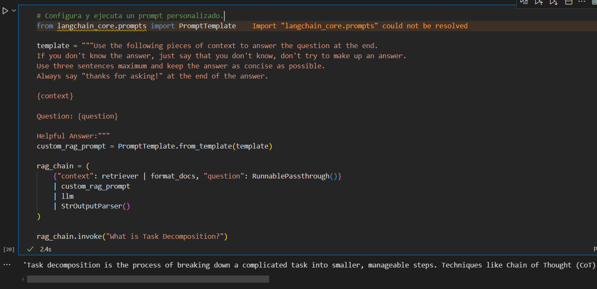

## Architectural Diagram
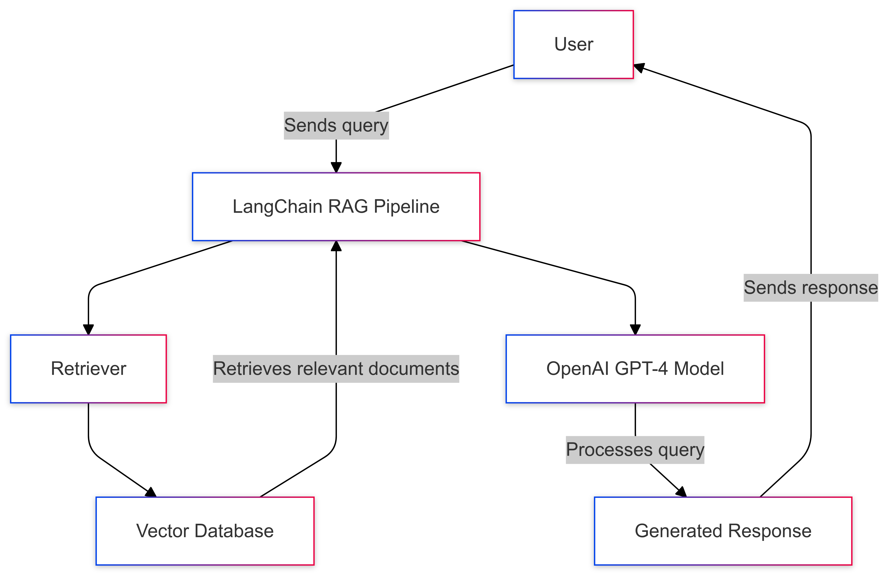
### Diagram Explanation

This architecture illustrates the workflow of the Retrieval-Augmented Generation (RAG) project using LangChain. The components and their interactions are as follows:

1. **User**: Represents the end-user who sends a query to the system.
2. **LangChain RAG Pipeline**: Orchestrates the project's workflow by integrating document retrieval and response generation components.
3. **Retriever**: Fetches relevant document chunks from the vector database based on the user's query.
4. **Vector Database**: Stores processed documents as vector embeddings to facilitate similarity-based search.
5. **OpenAI GPT-4 Model**: Processes the retrieved documents and the query to generate a meaningful response.
6. **Generated Response**: The final response delivered to the user, combining retrieved information and generated insights.

The system is designed to combine the strengths of retrieval (for context) and generative models (for response creation), ensuring accurate and contextual replies to user queries.


## Built With

* [Git](http://git-scm.com/) - Version Control System

## Versioning

I use [GitHub](https://github.com/) for versioning. For the versions available, see the [tags on this repository](https://github.com/Sebasvasquezz/LangChain-RAG-Tutorial.git).

## Authors

* **Juan Sebastian Vasquez Vega**  - [Sebasvasquezz](https://github.com/Sebasvasquezz)

## Date

November 14, 2024

## License

This project is licensed under the GNU License - see the [LICENSE.txt](LICENSE.txt) file for details.
